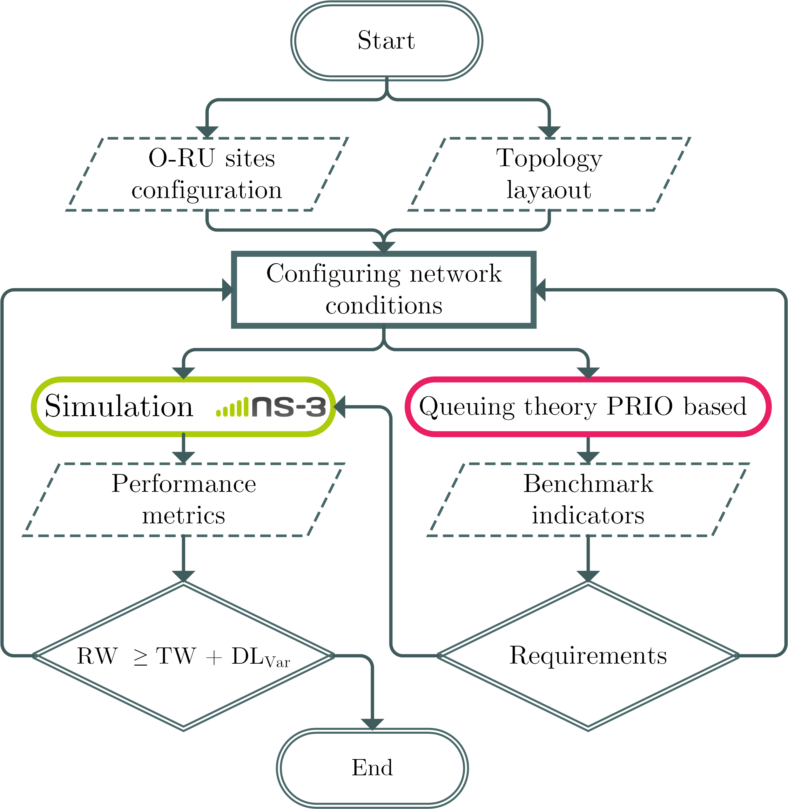

# Performance Evaluation of the Fronthaul Network under the O-RAN Paradigm


This repository contains an extended version of **ns-3 (v3.39)** with support for:

- Differentiated Services Code Point (DSCP) modeling
- Backplane capacity constraints inspired by real network devices

The goal of this modeling is to enable performance evaluations of network slices with different priority levels and to study the convergence of fronthaul and backhaul technologies during the network planning phase.

### Key Modifications

The main functional changes are made in the following modules:

- `point-to-point`: extended to model the switching fabric (backplane) capacity, mimicking the real behavior of networking devices.
- `traffic-control`: enhanced to support DSCP-based packet scheduling.

---

## Building ns-3

Run the following commands to build the modified version of ns-3, from within the `ns3-3.39` directory, run:

```bash
mkdir build
cd build
cmake ..
cd ..
CXXFLAGS="-W -Wall -g" ./ns3 configure --disable-werror --disable-python --disable-tests --disable-examples --build-profile=release
./ns3 build
mkdir sim_results
```


## Repository structure
 
 Folder                    | Description |
|---------------------------|-------------|
| `ofh-traffic-pcapanalysis` | Analysis of Open Fronthaul (O-FH) traffic based on real `.pcap` traces, including flow merging characterization and statistical extraction to support network planning. |
| `hl3hl5analysis`          | Centralization analysis between HL3 and HL5, considering different aggregation levels: (i) O-DUs allocated at HL3 managing a pool of 23 sites, and (ii) O-DUs at HL4 handling 9 sites. Various centralization distances are evaluated based on the IP Fusion network architecture of Telefónica Spain. In addition, HQoS analysis has been carried out over the same network, focusing on specific network segments.|
| `scratch`                 | Contains the ns-3 scenarios used to simulate network features. It also includes `.json` files that configure traffic parameters and other scenario-specific settings. |


### Analysis
This repository, as previously mentioned, includes the frameworks used to obtain benchmark performance indicators, along with the corresponding analyses. As shown in [Figure&nbsp;1](#fig-methodology), the first step is to evaluate the traffic load injected per site. This is achieved using **[traffic_conf.py](./ns-allinone-3.39/ns-3.39/hl3hl5analysis/traffic_conf.py)**. In addition, the simulation scenarios are stored in the [`scratch`](./ns-allinone-3.39/ns-3.39/scratch/) folder, together with their corresponding `.json` configuration files.

<p align="center" id="fig-methodology">
  
  <br>
  <em><strong>Figure 1.</strong> Proposed methodology for performance evaluation of the open fronthaul network.</em>
</p>

The [`scratch`](./ns-allinone-3.39/ns-3.39/scratch/) folder contains the scenarios and configuration files related to the spine–leaf topology shown in [Figure&nbsp;2](#fig-topology). The `.json` files define the traffic load injected per site, as well as network parameters such as HQoS policies and the backhaul traffic configuration. Two main scenarios are distinguished:  
- [`hl3hl5.cc`](./ns-allinone-3.39/ns-3.39/scratch/hl3-hl5.cc) – Implements a network-wide simulation approach.  
- [`hl3hl5theo.cc`](./ns-allinone-3.39/ns-3.39/scratch/hl3-hl5theo.cc) – Used to obtain metrics for a specific isolated node with HQoS polices in the network.  

<p align="center" id="fig-topology">
  
  <br>
  <em><strong>Figure 2.</strong> Spine–leaf topology with different hierarchical levels.</em>
</p>


#### One-way E2E delay in FH dedicated network
To evaluate the jitter experienced by the open-fronthaul traffic in the network, the [`hl3hl5analysis`](./ns-allinone-3.39/ns-3.39/hl3hl5analysis/) folder contains several Jupyter notebooks and scripts:

- [`runscen.py`](./ns-allinone-3.39/ns-3.39/hl3hl5analysis/runscen.py) – Executes simulation scenarios for the HL3HL5 analysis.
- [`Centralizationhl3hl5.ipynb`](./ns-allinone-3.39/ns-3.39/hl3hl5analysis/Centralizationhl3hl5.ipynb) – Processes simulation outputs and performs centralized performance evaluations.


#### HQoS node delay analysis
To obtain benchmark values for the open fronthaul traffic alongside backhaul technologies, the following scripts can be used to gather statistical results:

- [`ofh-flow-merging-analysis.ipynb`](./ns-allinone-3.39/ns-3.39/hl3hl5analysis/ofh-flow-merging-analysis.ipynb) - Demonstration of merging O-FH flows over the network.
- [`runscenbh.py`](./ns-allinone-3.39/ns-3.39/hl3hl5analysis/runscenbh.py) – Executes simulation scenarios for the HL3HL5 analysis with HQoS policies to validate the theoretical framework.  
- [`runscenbhhl3hl5CUT.py`](./ns-allinone-3.39/ns-3.39/hl3hl5analysis/runscenbhhl3hl5CUT.py) – Runs simulations at various link utilization levels to gather statistics related to dispersion and average values.  
- [`HQoS-analysis.ipynb`](./ns-allinone-3.39/ns-3.39/hl3hl5analysis/HQoS-analysis.ipynb) – Contains the analytical framework along with simulation-based validation to study the interplay between different technologies using priority-based scheduling policies.

## NS-3.39 Documentation

- [ns-3 Manual](https://www.nsnam.org/docs/release/3.39/manual/html/index.html) 
- [ns-3 Model-Library](https://www.nsnam.org/docs/release/3.39/models/html/index.html)


## :envelope_with_arrow:  Contact 
* [Fátima Khan Blanco (khanf@unican.es)](mailto:khanf@unican.es)
* [Luis Diez (diezlf@unican.es)](mailto:diezlf@unican.es)
* [Ramón Agüero (agueroc@unican.es)](mailto:agueroc@unican.es)